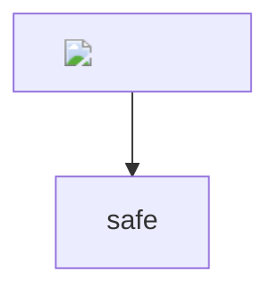

# Diagram XSS Tests



```flowchart
start=>start: 
end=>end: safe
start->end
```

```sequence
Alice->Bob: 
```

```vega-lite
{
  "$schema": "https://vega.github.io/schema/vega-lite/v5.json",
  "description": "<script>window.__marktextXss = 1</script>",
  "data": {
    "values": [
      { "category": "", "value": 1 },
      { "category": "safe", "value": 2 }
    ]
  },
  "mark": "bar",
  "encoding": {
    "x": { "field": "category", "type": "nominal" },
    "y": { "field": "value", "type": "quantitative" }
  }
}
```
